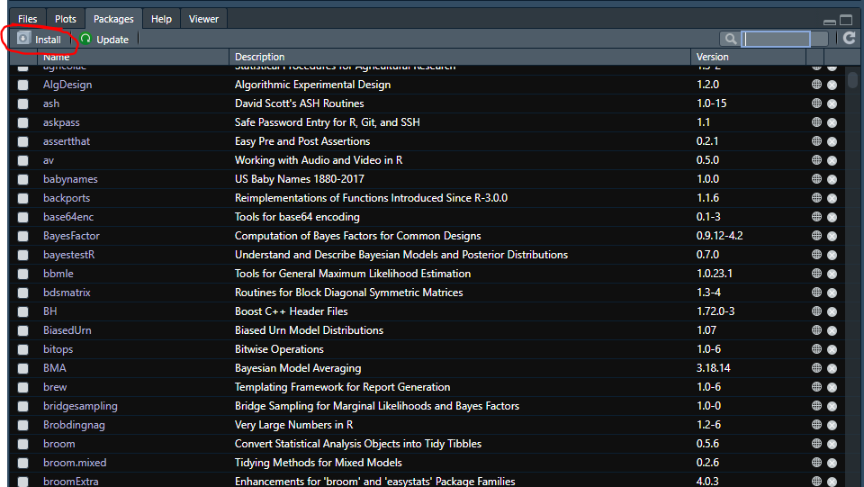
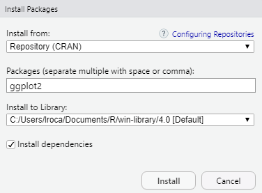
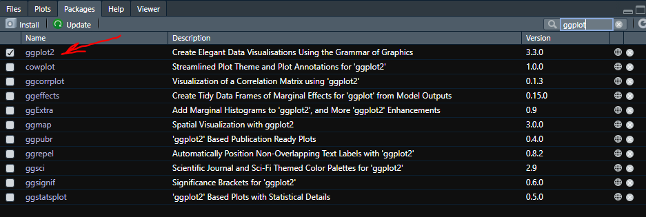
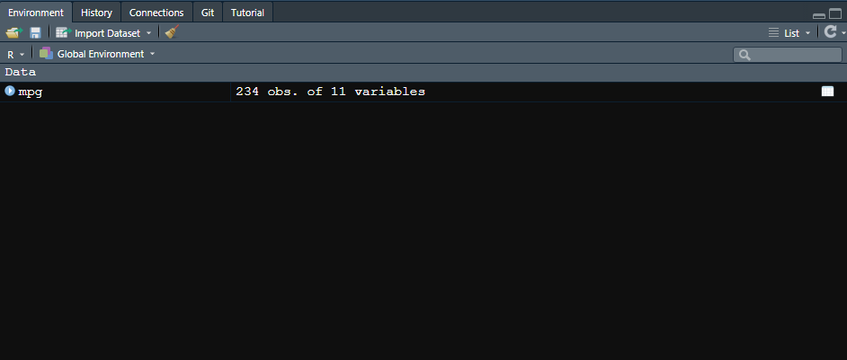

Untitled
================

# A. Conceptos básicos de R

Las bases de datos se guardan en formatos Data Frames o tibbles,
almacenados de manera tabular. Cualquier base de datos esta generalmente
en alguna de estas versiones. Es importante en consecuencia saber
manejar las bases de datos, saber observar su contenido abrir la pagina
de ayuda de las bases de datos guardadas en R y identificar el tipo de
variable y tipos en los dos formatos.

Trabajaremos con dos bases de datos para aprender los conceptos basico
su manejo.

-   mpg
-   flights

## 1. Instalación de paquetes (o librerias) de R

Las bases de datos generalmente se importan de nuestra computadora o web
(formatos csv, xlsx, github, otros). Sin embargo, para facilitar el
aprendizaje y enseñanza muchos de los paquetes de R ya vienen con bases
de datos preinstaladas a las que podemos ingresar rapidamente, luego de
instalar y activar el paquete (o libreria). Para instalar un paquete
podemos utilizar la interface de Rstudio.



En la pestaña de paquetes (“Packages”) damos click. En esta aparecera un
boton de instalación (“Install”) al cual daremos click. Esto abrira una
nueva pestaña en la que podemos colocar el nombre del paquete que
queramos instalar. Los nombres de los paquetes son unicos y se tienen
que saber de antemano para poder buscarlos. Es por tal motivo importante
familiarizarse con los principales paquetes de R e ir adicionando mas
conforme nuestros objetivos especificos.



De igual manera, podemos instalar cualquier paquete mediante codigo,
para esto se coloca dentro de la funcion install.packages() el nombre
del paquete entre comillas. Por ejemplo, si quisieramos instalar el
paquete llamado “ggplot2” utilizariamos el siguiente codigo:

-   install.packages(“ggplot2”)

Al correr esta linea de codigo, el paquete comenzara automaticamente en
Rstudio e instalara.

## 2. Activación de paquetes (o librerias) en R

Una vez instalado un paquete en nuestra computadora, siempre estará
disponible al abrir R o Rstudio (a menos que exista algun inconveniente
que no pida desintalar e instalar nuevamente el paquete o si instalamos
una nueva version de R, etc.). Sin embargo, que este activado, no
significa que este disponible para su uso. Cada vez que iniciamos una
nueva sesion o un nuevo proyecto o un nuevo script(manuscrito) debemos
activar la libreria que usaremos. Por ejemplo, si queremos activar el
paquete ggplot2, lo haremos utilizando la funcion library():

``` r
library(ggplot2)
```

Una vez activado, podemos verificarlo qen la pestaña de paquetes. Si el
nombre del paquete aparece con un check, significa que esta activado,
como se puede visualizar en la siguiente figura:



\#B. Bases de datos en paquetes de R

La primera base de datos que cargaremos se encuentra dentro del paquete
ggplot2, ya que esta instalado y activado, podemos aumentar la base de
datos a nuestro ambiente de trabajo mediante la funcion data():

``` r
data(mpg)
```

Podra visaulizar que la pestaña de ambiente, aparacio la nueva base de
datos llamada mpg. Si le damos click encima, podemos visualizar en que
consiste esta base. Recordar que solo hace falta llamar una vez la base
de datos, luego permanecerá disponible para su uso.



Podemos visualizar la data con tan solo llamarla por su nombre:

``` r
mpg
```

    ## # A tibble: 234 x 11
    ##    manufacturer model    displ  year   cyl trans   drv     cty   hwy fl    class
    ##    <chr>        <chr>    <dbl> <int> <int> <chr>   <chr> <int> <int> <chr> <chr>
    ##  1 audi         a4         1.8  1999     4 auto(l~ f        18    29 p     comp~
    ##  2 audi         a4         1.8  1999     4 manual~ f        21    29 p     comp~
    ##  3 audi         a4         2    2008     4 manual~ f        20    31 p     comp~
    ##  4 audi         a4         2    2008     4 auto(a~ f        21    30 p     comp~
    ##  5 audi         a4         2.8  1999     6 auto(l~ f        16    26 p     comp~
    ##  6 audi         a4         2.8  1999     6 manual~ f        18    26 p     comp~
    ##  7 audi         a4         3.1  2008     6 auto(a~ f        18    27 p     comp~
    ##  8 audi         a4 quat~   1.8  1999     4 manual~ 4        18    26 p     comp~
    ##  9 audi         a4 quat~   1.8  1999     4 auto(l~ 4        16    25 p     comp~
    ## 10 audi         a4 quat~   2    2008     4 manual~ 4        20    28 p     comp~
    ## # ... with 224 more rows

Todas las bases de datos guardadas en cualquier paquete de R, siempre
tiene una pagina de ayuda que nos permite saber a mayor detalle en que
consiste la base de datos. Para acceder facilmente a ella podemos
escribir el simbolo “?” adelante de la base de datos, por ejemplo:

-   ?mpg

Lo cual cargará y nos dará como resultado en que consiste la base de
datos, como observamos en la figura: 
