Conceptos Básicos en R
================

Antes de comenzar a escribir codigos y interactuar con R, debemos de
crear un nuevo proyecto. Para ello, iremos a la ventada de Archivo
(File) -&gt; Nuevo proyecto (New Project)

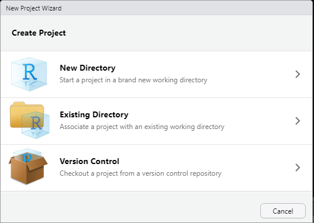 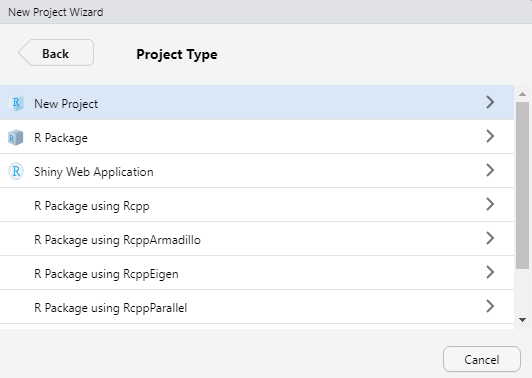 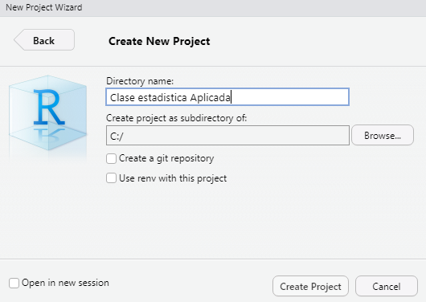

Si seguimos correctamente la correlación de figuras y creamos sin
problemas un nuevo proyecto, tendremos como resultado la siguiente
figura (quiza con otros colores de fondo y letras):

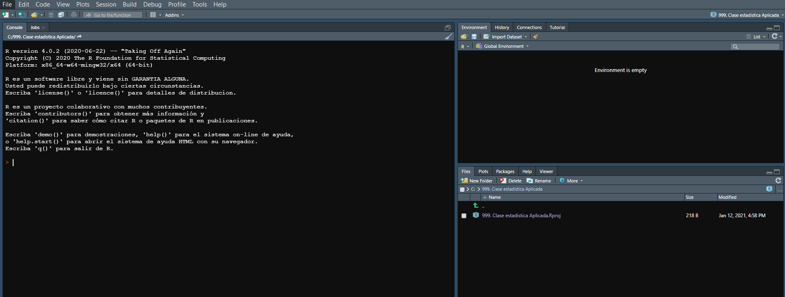

Sin bien, pueden comenzar a escribir en la consola, no es lo normal, ni
recomendable. Normalmente cuando aprendemos a usar el lenguaje de
programacion R, utilizando Rstudio, escribimos todo nuestro codigo en un
formato especial llamado “script” el cual es un tipo de archivo “.R”.
Por muchos años este tipo de archivo ha sido usado en el software
Rstudio para escrir nuestros codigos y tiene sus caracateristicas. Sin
embargo, en los ultimos años, una actualización de este “script”
(manuscrito) esta tomando relevancia y apunta a reemplazar la manera en
que trabajamos. Este nuevo tipo de formato se llama Rmarkdown y es el
que se ha usado para esta clase.

Repasemos algunos concepto basicos de un script. Para su creación vamos
a la opcion Archivo (File) del programa y colocamos nuevo archivo -&gt;
Script.

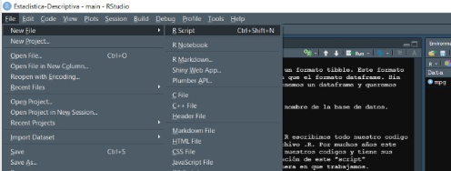

Esto abrira un script en blanco sin nombre y sin guardarse
auutomaticamente, tendremos que seleccionarlo e ir a archivo -&gt;
Guardar como (colocamos el nombre de nuestro archivo y la terminación
.R). Cuando guardemos, este nuevo archio aparecerá en nuestra pesataña
de Archivos donde antes solo estaba el proyecto.

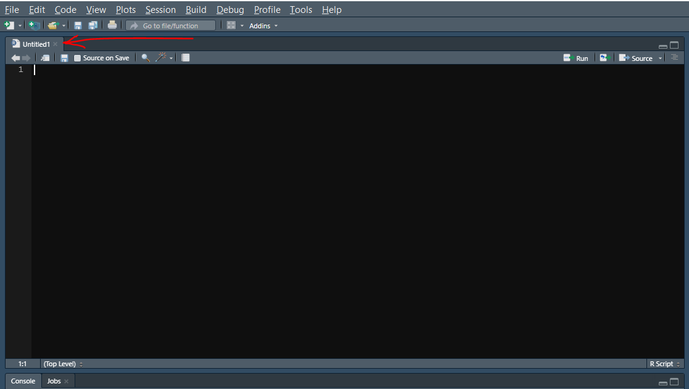 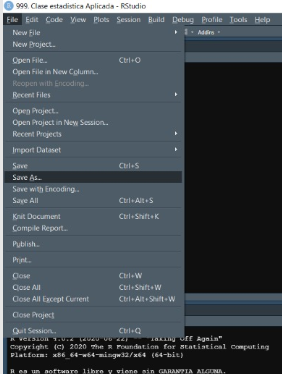 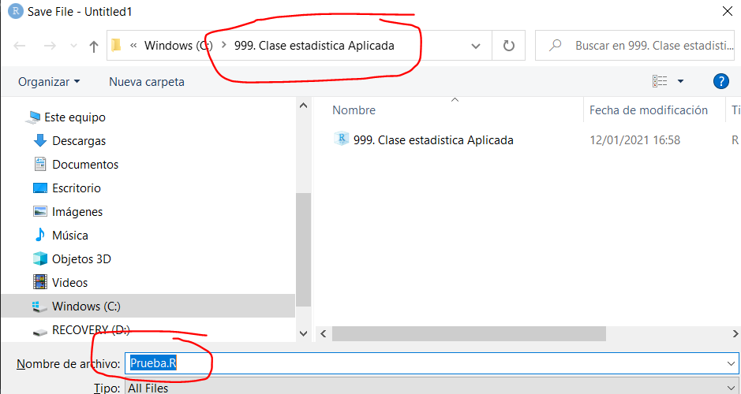
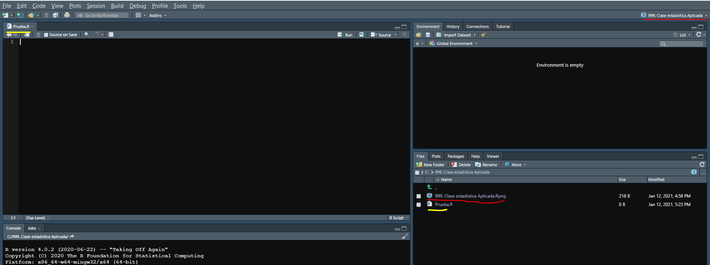

Una vez creado el script y guardado, podemos comenzar a codificar y
obtener resultados fantasticos con nuestras bases de datos.

Por otro lado, para crear un archivo Rmarkdown, los pasos son muy
parecidos. Vamos a Archivo -&gt; Nuevo archivo -&gt;

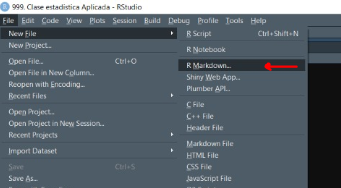 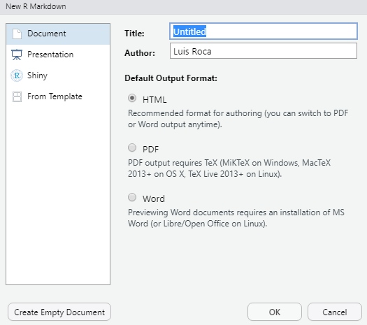 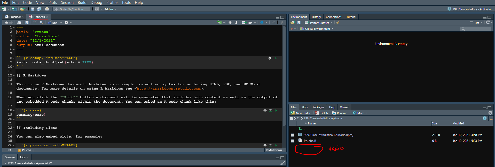

Para guardar el archivo Rmarkdown, se deben realizar los mismos pasos.
Archivo -&gt; Guardar como. Colocaremos el nombre y le daremos guardar.
Nota: el tipo de archico ya no es un archivo “.R”, es en cambio un tipo
de archivo “.Rmd”.

En clase, los estudiantes trabajaran inicialmente en scripts normales,
mientras que van incursionando en archivos Rmarkdown. Los archivos tipo
script son mejores para hacer borradores y los Rmarkdown se han creado
principalmente para comunicar resultados de formas elegantes (mas acerca
de este tipo de formato se aprenderá a final del curso de estadistica
aplicada para la ingenieria).

Una vez tengamos un script abierto, guardado y en blanco, podemos
comenzar con los primeros pasos en R, la instalacion de paquetes y los
conceptos generales de este maravilloso lenguaje de programación.

# A. Primeros pasos: Como funciona Rstudio

Cuando trabajamos con formatos script, normalmente interactuamos
constantemente con la consola (pestaña en una de las cuatro ventanas de
Rstudio). Por ejemplo, una función para entender esta interaccion es el
comando *print()*, este nos permite escribir cualquier cosa en el script
y tenerlo como resultado en la consola:

``` r
print("Esto es un ejemplo")
```

    ## [1] "Esto es un ejemplo"

Cuando escriban esto en su script y le den al boton de Correr o “Run” en
la parte superior del Script, despues de unos segundos de carga, lo
veran aparecer como resultado en la consola. Podemos escribir mucho
codigo en nuestros scripts pero si no damos click en “Run”, este codigo
nunca se ejecutará y nunca veremos el resultado. En la figura se puede
ver el boton de Run resaltado.

 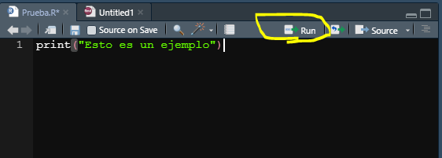

Como se puede ver, para correr un “pedazo” de codigo especifico tenemos
dos opciones, sobrear todo lo que queremos “Correr” o colocar el mouse
en alguna parte de la linea de codigo que queramos correr (que es quiza
lo mas práctico, solo aseguremosnos que el curso del texto esta en
alguna parte de la linea de codigo). Para trabajar de manera práctica,
sin depender del mouse, podemos utilizar el comando rapido para “Correr”
codigos, este es usando las teclas *Ctrl + Enter*. De esta manera no
tendremos que recurrrir a apretar siempre el boton de “Run”.

Listo, ahora sabemos como interactuar desde nuestro script a nuestra
consola o como veremos mas adelante con nuestra pestaña de “Ambiente”,
“Plots”, entre otros. Todo los manejamos desde el Script, y mandamos las
ordenes desde alli.

# B. Lo mas importante: Instalación y activación de paquetes

Las bases de datos se guardan en formatos Data Frames o tibbles,
almacenados de manera tabular. Cualquier base de datos esta generalmente
en alguna de estas versiones. Es importante en consecuencia saber
manejar las bases de datos, saber observar su contenido abrir la pagina
de ayuda de las bases de datos guardadas en R y identificar el tipo de
variable y tipos en los dos formatos.

Trabajaremos con dos bases de datos para aprender los conceptos basico
su manejo.

-   mpg
-   flights

## 1. Instalación de paquetes (o librerias) de R

Las bases de datos generalmente se importan de nuestra computadora o web
(formatos csv, xlsx, github, otros). Sin embargo, para facilitar el
aprendizaje y enseñanza muchos de los paquetes de R ya vienen con bases
de datos preinstaladas a las que podemos ingresar rapidamente, luego de
instalar y activar el paquete (o libreria). Para instalar un paquete
podemos utilizar la interface de Rstudio.


En la pestaña de paquetes (“Packages”) damos click. En esta aparecera un
boton de instalación (“Install”) al cual daremos click. Esto abrira una
nueva pestaña en la que podemos colocar el nombre del paquete que
queramos instalar. Los nombres de los paquetes son unicos y se tienen
que saber de antemano para poder buscarlos. Es por tal motivo importante
familiarizarse con los principales paquetes de R e ir adicionando mas
conforme nuestros objetivos especificos.


De igual manera, podemos instalar cualquier paquete mediante codigo,
para esto se coloca dentro de la funcion install.packages() el nombre
del paquete entre comillas. Por ejemplo, si quisieramos instalar el
paquete llamado “ggplot2” utilizariamos el siguiente codigo:

-   install.packages(“ggplot2”)

Al correr esta linea de codigo, el paquete comenzara automaticamente en
Rstudio e instalara.

## 2. Activación de paquetes (o librerias) en R

Una vez instalado un paquete en nuestra computadora, siempre estará
disponible al abrir R o Rstudio (a menos que exista algun inconveniente
que no pida desintalar e instalar nuevamente el paquete o si instalamos
una nueva version de R, etc.). Sin embargo, que este activado, no
significa que este disponible para su uso. Cada vez que iniciamos una
nueva sesion o un nuevo proyecto o un nuevo script(manuscrito) debemos
activar la libreria que usaremos. Por ejemplo, si queremos activar el
paquete ggplot2, lo haremos utilizando la funcion library():

``` r
library(ggplot2)
```

Una vez activado, podemos verificarlo qen la pestaña de paquetes. Si el
nombre del paquete aparece con un check, significa que esta activado,
como se puede visualizar en la siguiente figura:


# C. Cargando bases de datos provenientes de paquetes de R

La primera base de datos que cargaremos se encuentra dentro del paquete
ggplot2, ya que esta instalado y activado, podemos aumentar la base de
datos a nuestro ambiente de trabajo mediante la funcion data():

``` r
data(mpg)
```

Podra visaulizar que la pestaña de ambiente, aparacio la nueva base de
datos llamada mpg. Si le damos click encima, podemos visualizar en que
consiste esta base. Recordar que solo hace falta llamar una vez la base
de datos, luego permanecerá disponible para su uso.


Podemos visualizar la data con tan solo llamarla por su nombre:

``` r
mpg
```

    ## # A tibble: 234 x 11
    ##    manufacturer model    displ  year   cyl trans   drv     cty   hwy fl    class
    ##    <chr>        <chr>    <dbl> <int> <int> <chr>   <chr> <int> <int> <chr> <chr>
    ##  1 audi         a4         1.8  1999     4 auto(l~ f        18    29 p     comp~
    ##  2 audi         a4         1.8  1999     4 manual~ f        21    29 p     comp~
    ##  3 audi         a4         2    2008     4 manual~ f        20    31 p     comp~
    ##  4 audi         a4         2    2008     4 auto(a~ f        21    30 p     comp~
    ##  5 audi         a4         2.8  1999     6 auto(l~ f        16    26 p     comp~
    ##  6 audi         a4         2.8  1999     6 manual~ f        18    26 p     comp~
    ##  7 audi         a4         3.1  2008     6 auto(a~ f        18    27 p     comp~
    ##  8 audi         a4 quat~   1.8  1999     4 manual~ 4        18    26 p     comp~
    ##  9 audi         a4 quat~   1.8  1999     4 auto(l~ 4        16    25 p     comp~
    ## 10 audi         a4 quat~   2    2008     4 manual~ 4        20    28 p     comp~
    ## # ... with 224 more rows

Todas las bases de datos guardadas en cualquier paquete de R, siempre
tiene una pagina de ayuda que nos permite saber a mayor detalle en que
consiste la base de datos. Para acceder facilmente a ella podemos
escribir el simbolo “?” adelante de la base de datos, por ejemplo:

-   ?mpg

Lo cual cargará y nos dará como resultado en que consiste la base de
datos, como observamos en la figura: 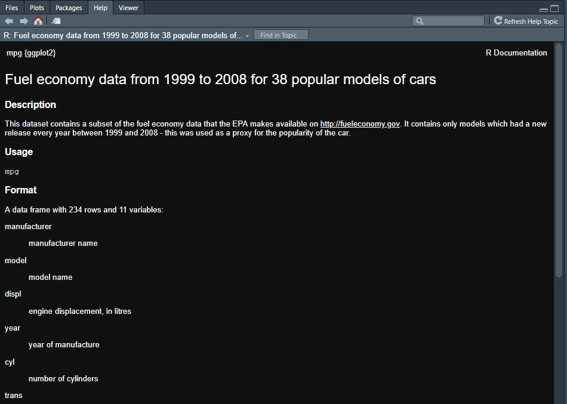

Regresando a la base de datos mpg, pudimos observar que al cargarla nos
ofrece informacion general, como el numero de filas (individuos) y
columnas (variables).


En la figura observamos por ejemplo que tiene 234 filas y 11 columnas
(rojo). Tambien podemos observar que cada una de las variables tiene una
etiqueta de tres letras, por ejemplo <chr>, <dbl>, <int>, etc. Las
cuales hemos visto en clase y nos da la informacion de que tipo de
variables tenemos en nuestra base de datos (aunque a veces hay que
modificar la interpretación del software ya que se puede equivocar o
tener objetivos diferentes a los del investigador).

Tambien podemos observar al comienzo de la tabla que se trata de un
formato tibble. Este formato brinda detalle adicional y mantiene la base
de datos mas ordenada que el formato dataframe. Sin embargo, ambos
formatos se siguen utilizando el dia de hoy. Si tenemos un dataframe y
queremos pasarlo a formato tibble, usaremos el comando:

-   as\_tibble() : donde el argumento que colocaremos será igual al
    nombre de la base de datos.

# D. Conceptos del lenguaje de programación R:

## 1. Definiendo variables

A estas alturas estarán familiarizados con las pestañas de Rstudio.
Habrán podido observar una en particular llamada “Environment” o
“Ambiente”. En esta ventana se van a ir depositando todas las bases de
datos que carguemos y vayamos guardando, esto para su posterior uso. Es
como nuestra mochila, donde guardamos cosas de valor en un viaje para
tenerlas a la mano. Asi como cuando preparamos la mochila para un viaje
e incorporamos objeto por objeto, tambien lo hacemos en nuestra ventana
de “Environment”. Sin embargo, en vez de herramientas y objetos
personales, principalmente almacenamos bases de datos, variables,
vectores o funciones. Es decir, todo aquello que podemos utilizar para
correr una tecnica estadistica o realizar un grafico en Rstudio.

Ya hemos visto como cargar bases de datos a nuestro ambiente con la
funcion(data), pero esto solo funciona cuando nosotros cargamos bases de
datos previamente cargados en paquetes de R. Existen otras maneras de
cargar bases de datos como se menciono anteriormente, pero se les debe
de asignar una variable. Antes de hacer este ejercicio, es recontra
importante aprender a asignar valores a una variable. Para esto,
comenzaremos con un ejemplo simple. Supongamos que nuestra variable se
llama X y es igual al numero 3. Para asignar este valor a X,
utilizaremos los simbolos “&lt;-”. Entonces seria de la siguiente
manera:

``` r
 X <- 3
```

Una vez corramos este codigo (no aparecera ningun resultado en la
consola), veran que despues de uno segundo, aparecerá en nuestra ventana
de “Environment” en valor de X y se le asignará el numero 3.

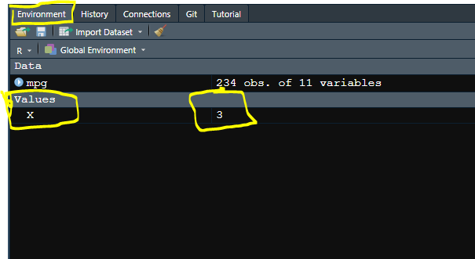

Nota: Es importante reconocer desde ya, que el lenguaje R es super
susceptible a los caracteres y diferencia entre mayusculas y minusculas,
espacios, etc. Por ejemplo si ahora queremos asignarla a una nueva
variable “x” (**miniscula**) el valore de 5, podremos hacerlo de la
siguiente manera:

``` r
x <- 5
```

Podremos ver que efectivamente hay un nuevo valor llamado x (minuscula)
y que se le asigno el valore de 5.

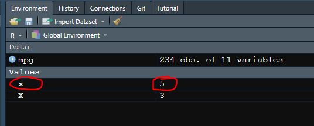

¿Qué pasa si le asignamos un nuevo valor a la variable X o x? Lo que
ocurrira es que el nuevo valor que le asignamos reemplazará al anterior
y esto lo podremos ver en la ventana de “Ambiente” una vez corramos el
siguiente codigo (donde asignamos el valore de 6 a X:

``` r
X <-6
```

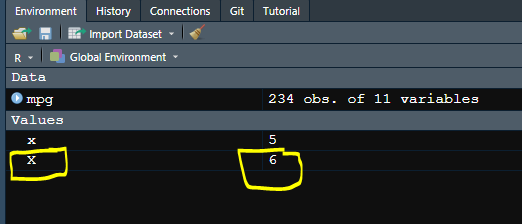

De esta manera sencilla hemos aprendido como asignar valores a las
variables. Los valores que podemos asignar a una variable son diversos y
de gran numero. Podemos asignar a una variable un grafico, un modelo,
una base de datos, un vector, etc. ¿Qué es precisamente un vector?. Un
vector es un conjunto de datos para una sola variable, de una longitud
determinada por el investigador o la base de datos evaluada. Para crear
un vector de valores (sean cualitativos o cuantitativos) debemos de usar
el comando **c()** y dentro de este, colocaremos el conjunto de valores
que tiene el vector. Por ejemplo, si queremos crear un vector llamado
“Vector\_Ejemplo” lo haremos de la siguiente manera:

``` r
Vector_Ejemplo <- c(1, 2, 3, 4, 5, 6, 7, 8, 9, 10)
```

Veremos que en nuestra ventana “Environment” aparecio este nuevo vector
con todos los valores que le hemos dado. Podemos hacer ahora un vector
de solo valores cualitativos, como por ejemplo colores (al que
llamaremos Vector\_Ejemplo2):

``` r
Vector_Ejemplo2 <- c("azul", "rojo", "amarillo", "celeste", "marrón")
```

En esta oportunidad se creo el vector con los colores, que son datos
cualitativos, en R hay dos formas de tratar datos cualitativos, por
muchos años se a usado el tipo de dato *chr* (character), el cual nos
indica que es un dato de tipo *texto*. Pero en los ultimos años se
prefiere a utilizar la unidad *fct* (factor), de uso especial para el
trato de variables categoricas. La diferencia es bien marcada, ya que
los datos tipo texto, son eso, datos que nos sirven para evaluar texto
(insvestigaciones cualitativas, analisis de sentimiento, etc.). Sin
embargo, las variables tipo *fct* son estrictamente variables
categoricas que nos permiten correr analisis estadisticos sin errores.
Por el momento trabajaremos con datos tipo texto y aprenderemos un
paquete especializado en factores mas adelante. Las variables tipo
texto, nos permiten hasta cierto margen utilizarlas como variables
categoricas.

Existen otro tipo de variable, como el boleano, que indica si algo es
verdadero o falso. Por ejemplo podemos crear un tercer vector ejemplo
con este tipo de unidades:

``` r
Vector_Ejemplo3 <- c(TRUE, TRUE, FALSE, TRUE, FALSE)
```

Este tipo de vector, tiene variables del tipo *logi* (logicos), los
cuales nos permiten realizar operaciones con operadores boleano de
logica (visto en clase teorica).

Como vimos en clases, existen otros tipos de variables que iremos usando
durante el curso. A manera de repaso se enseñan a continuación:

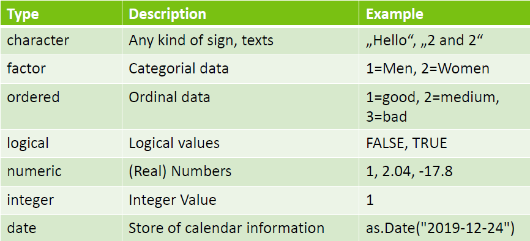

Nota: Al momento de crear una variable es una buena práctica utilizar
nombres cortos de una sola palabra. En caso sea necesario usar mas de 1
palabra, se estila utizar guion bajo para unirlas, ya que el lenguaje R
considera a los espacios en blanco como errores si es que no son dentro
de una función. Los estilos para crear una variable compuesta pueden ser
los siguientes:

-   Vector\_Ejemplo
-   Vector\_ejemplo
-   vector\_ejemplo
-   VectorEjemplo

Vemos sutiles diferencias, trabajar con la forma que le paresca mas
práctica o una nueva que usted se le acomode, la regla es no dejar
espacios en blanco al momento de asignar un nombre a una variable, base
de datos u otro tipo de información en R.

## 2. Operacdores aritmeticos y logicos

Para recordar, tenemos operadores aritmenticos en lenguaje R:

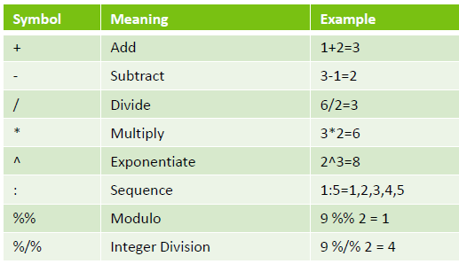

Como tambien operadores logicos o de relación:

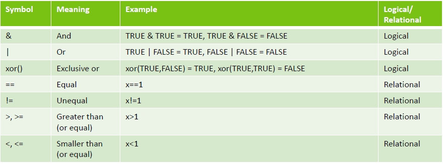

## 3. Operaciones entre unidades, vectores, matrices, listas y bases de datos

Las operaciones tanto aritmeticas, como logicas se pueden realizar en
los diferentes tipos de bases de datos, en R, podemos tener unidades,
vectores, matrices, listas y bases de datos. A continuación un resumen:


Trabajaremos principalmente con bases de datos de tipo dataframe o
tibbles. En algunos casos utilizaremos tambien vectores, por lo cual es
importante manejarlos correctamente.

## 4. Manejo de bases de datos básico, acceder a una variable específica

Mas adelante veremos el paquete “dplyr” que nos permitira modificar y
manipular bases de datos, hay sin embargo dos maneras “antiguas” pero
aun utiles al momento de ingresar a una variable de una base de datos.

Podemos ingresar utilizando el simbolo de dolar **“$”** o utilizando
dobles corchetes ***\[\[\]\]***. Tenemos la base de datos “mpg” cargada.
Podemos observar al detalle que hay adentro con la funcion View():

``` r
View(mpg)
```

Este comando nos abrira un formato ordenado de la base de datos, donde
entre otras cosas podremos observar los nombres de las variables en la
parte superior. Por ejemplo, el año (“year”) es una de estas variables.
Podemos acceder a esta variable mediante los operadores señalados, pero
antes vamos a asignar el resultado de la eleccion de una variable a una
variable que crearemos llamada Seleccion\_variable1

``` r
Seleccion_variable1 <- mpg$year
```

Para visualizar el resultado en la consola tenemos que llamar a la
variable por su nombre y correrla (“Run”)

``` r
Seleccion_variable1
```

    ##   [1] 1999 1999 2008 2008 1999 1999 2008 1999 1999 2008 2008 1999 1999 2008 2008
    ##  [16] 1999 2008 2008 2008 2008 2008 1999 2008 1999 1999 2008 2008 2008 2008 2008
    ##  [31] 1999 1999 1999 2008 1999 2008 2008 1999 1999 1999 1999 2008 2008 2008 1999
    ##  [46] 1999 2008 2008 2008 2008 1999 1999 2008 2008 2008 1999 1999 1999 2008 2008
    ##  [61] 2008 1999 2008 1999 2008 2008 2008 2008 2008 2008 1999 1999 2008 1999 1999
    ##  [76] 1999 2008 1999 1999 1999 2008 2008 1999 1999 1999 1999 1999 2008 1999 2008
    ##  [91] 1999 1999 2008 2008 1999 1999 2008 2008 2008 1999 1999 1999 1999 1999 2008
    ## [106] 2008 2008 2008 1999 1999 2008 2008 1999 1999 2008 1999 1999 2008 2008 2008
    ## [121] 2008 2008 2008 2008 1999 1999 2008 2008 2008 2008 1999 2008 2008 1999 1999
    ## [136] 1999 2008 1999 2008 2008 1999 1999 1999 2008 2008 2008 2008 1999 1999 2008
    ## [151] 1999 1999 2008 2008 1999 1999 1999 2008 2008 1999 1999 2008 2008 2008 2008
    ## [166] 1999 1999 1999 1999 2008 2008 2008 2008 1999 1999 1999 1999 2008 2008 1999
    ## [181] 1999 2008 2008 1999 1999 2008 1999 1999 2008 2008 1999 1999 2008 1999 1999
    ## [196] 1999 2008 2008 1999 2008 1999 1999 2008 1999 1999 2008 2008 1999 1999 2008
    ## [211] 2008 1999 1999 1999 1999 2008 2008 2008 2008 1999 1999 1999 1999 1999 1999
    ## [226] 2008 2008 1999 1999 2008 2008 1999 1999 2008

Como pueden ver, hemos seleccionado solo un vector de la base de datos
original “mpg”, mediante el operador dolar **$**. Esto se puede realizar
del mismo modo utilizando dobles corchetes (***\[\[\]\]***), y dentro de
los corchetes colocaremos la posicion de la variable que queramos
seleccionar, en este caso la variabel año (“year”) se encuentra en la
cuarta posición, seria de la siguiente manera:

``` r
Seleccion_variable2 <- mpg[[4]]
```

Llamamos a la variable con combre “Seleccion\_variable2”:

``` r
Seleccion_variable2
```

    ##   [1] 1999 1999 2008 2008 1999 1999 2008 1999 1999 2008 2008 1999 1999 2008 2008
    ##  [16] 1999 2008 2008 2008 2008 2008 1999 2008 1999 1999 2008 2008 2008 2008 2008
    ##  [31] 1999 1999 1999 2008 1999 2008 2008 1999 1999 1999 1999 2008 2008 2008 1999
    ##  [46] 1999 2008 2008 2008 2008 1999 1999 2008 2008 2008 1999 1999 1999 2008 2008
    ##  [61] 2008 1999 2008 1999 2008 2008 2008 2008 2008 2008 1999 1999 2008 1999 1999
    ##  [76] 1999 2008 1999 1999 1999 2008 2008 1999 1999 1999 1999 1999 2008 1999 2008
    ##  [91] 1999 1999 2008 2008 1999 1999 2008 2008 2008 1999 1999 1999 1999 1999 2008
    ## [106] 2008 2008 2008 1999 1999 2008 2008 1999 1999 2008 1999 1999 2008 2008 2008
    ## [121] 2008 2008 2008 2008 1999 1999 2008 2008 2008 2008 1999 2008 2008 1999 1999
    ## [136] 1999 2008 1999 2008 2008 1999 1999 1999 2008 2008 2008 2008 1999 1999 2008
    ## [151] 1999 1999 2008 2008 1999 1999 1999 2008 2008 1999 1999 2008 2008 2008 2008
    ## [166] 1999 1999 1999 1999 2008 2008 2008 2008 1999 1999 1999 1999 2008 2008 1999
    ## [181] 1999 2008 2008 1999 1999 2008 1999 1999 2008 2008 1999 1999 2008 1999 1999
    ## [196] 1999 2008 2008 1999 2008 1999 1999 2008 1999 1999 2008 2008 1999 1999 2008
    ## [211] 2008 1999 1999 1999 1999 2008 2008 2008 2008 1999 1999 1999 1999 1999 1999
    ## [226] 2008 2008 1999 1999 2008 2008 1999 1999 2008

## 5. Funciones de recurrentes y básicas para utilizar

\#CONCLUSIONES

Hemos visto de manera general como funciona Rstudio y como podemos
utilizar el lenguaje de programación dentro de el. Existen
adicionalmente otras funciones claves dentro del lenguaje de
programación básico de R, pero es probable que no los necesitemos en el
curso de estadistica aplicada o los veamos sutilmente en los ultimos
temas. Con lo aprendido en esta primera parte introductoria basta para
comenzar a aprender especificamente que hacen diferentes paquetes y para
que los podemos usar. Durante el curso, veremos los principales paquetes
básicos de R, pero en la actualidad existe un sin numero de paquetes
almacenados en los servidores de R (repositorio CRAN) o paquetes piloto
almacenados en GitHub (los que aun tienen que pasar pruebas y ensayos
para ser oficiales).
